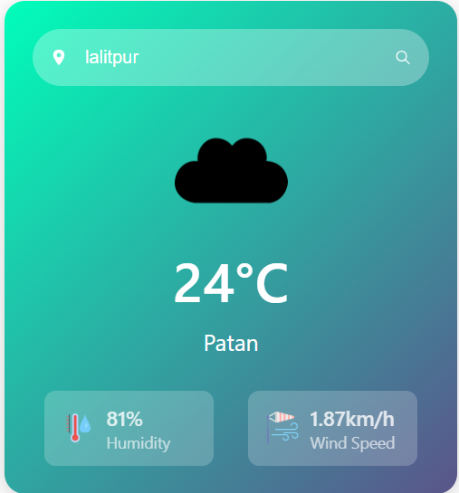

# Weather App 🌤️

A simple and beautiful React-based weather application that fetches real-time weather data using the OpenWeatherMap API. It shows temperature, humidity, wind speed, and relevant weather icons based on the current city.

## 🚀 Features

- 🔍 Search weather by city
- 🌡️ Current temperature display
- 💨 Wind speed and humidity
- 🌦️ Weather icons based on condition

---

## 🛠️ Technologies Used

- **React.js**
- **CSS**
- **OpenWeatherMap API**
- **React Icons**

---

## 📷 Screenshot



## ⚙️ Setup Instructions

1. **Clone the repository**
   ```bash
   git clone https://github.com/bibeklams/Weather-App.git
   cd Weather-App
   ```
